# 인스타그램 댄스 챌린지 트렌드 리서치

> **조사일** 2026-09-05 · **방법** Instagram 검색 탭 `댄스챌린지` 키워드 · **표본** 검색 결과 44개 게시물 수집 → 최근 3개월(2026-06~08) 위주 19개 선별
> 썸네일은 `../website/thumbs/` 폴더에 로컬 저장되어 있어 인스타 CDN 링크가 만료되어도 깨지지 않습니다.

## 한눈에 보기

| 순위 | 챌린지 | 시기 | 근거 |
|---|---|---|---|
| 🥇 | **GUAP 챌린지** | 7월~8월 (진행 중) | 검색 상위에 6건 중복 등장, 참여 40만+ |
| 🥈 | **I WANT YOU BACK** | 7월~ | BTS 제이홉·정국 참여, 원곡자 NSYNC 반응 |
| 🥉 | **TUIDE 'GRLS'** | 8월 말 (신규) | 수집 게시물 중 최신(8/30), "요즘 제대로 난리남" |
| — | Aeropickles / GG EZ / Lemonade / REDRED / It's Me | 6월~8월 | 꾸준히 도는 K-pop·밈 안무 |

---

## 1. GUAP 챌린지 🥇

음원 계정 **@emetsound** 의 'GUAP'에 맞춘 안무. 8월 현재 검색 결과를 가장 많이 점유한 트렌드로, 7월 중순 이미 참여 40만 건을 넘겼습니다. 매거진 계정들이 잇따라 트렌드 해설 콘텐츠를 낼 만큼 화제성이 큽니다.

| 썸네일 | 게시물 | 계정 | 날짜 | 좋아요 |
|---|---|---|---|---|
| <a href="https://www.instagram.com/p/Db74TXwxRoU/">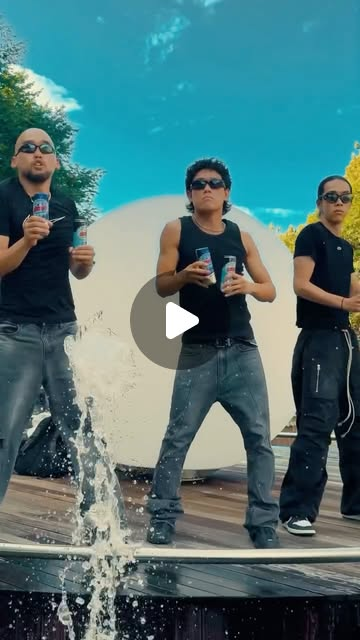</a> | [원 음원 계정 · "댄스챌린지 도전할 사람 굅✋"](https://www.instagram.com/p/Db74TXwxRoU/) | `emetsound` | 2026-08-12 | 1,533 |
| <a href="https://www.instagram.com/p/DbpxIzNzrc8/">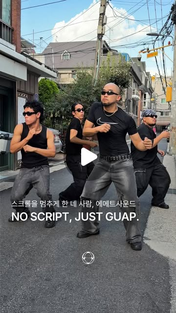</a> | [PAP 매거진 · "스크롤을 멈추게 한 네 사람"](https://www.instagram.com/p/DbpxIzNzrc8/) | `pap_magazine` | 2026-08-05 | 4,302 |
| <a href="https://www.instagram.com/p/DcEDqhrToIe/">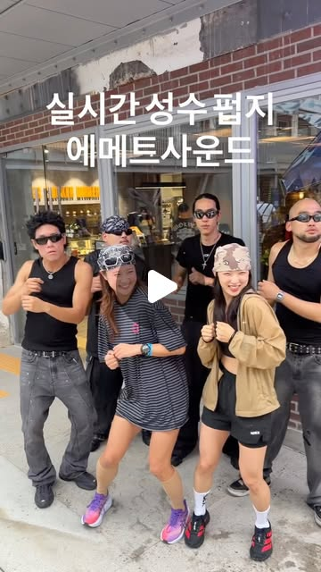</a> | [듀듀 · "파리 잡는 거 아님"](https://www.instagram.com/p/DcEDqhrToIe/) | `dewdew.fd` | 2026-08-15 | 542 |
| <a href="https://www.instagram.com/p/DbLMOqrj6qk/">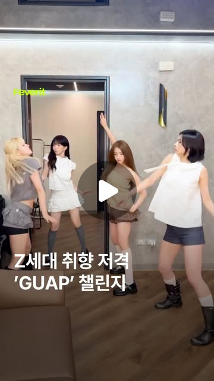</a> | [피버릿 · "GUAP 챌린지? 그냥 느껴"](https://www.instagram.com/p/DbLMOqrj6qk/) | `feverit.mag` | 2026-07-24 | — |
| <a href="https://www.instagram.com/p/Dap1_XSzkHY/">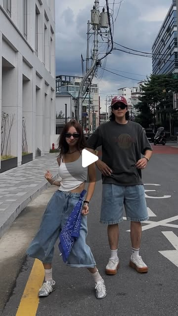</a> | [A d D E · "40만이 넘은 #guap 춤 뒤로.."](https://www.instagram.com/p/Dap1_XSzkHY/) | `shop_adde` | 2026-07-11 | 555 |

## 2. I WANT YOU BACK 챌린지 🥈

30년 전 **NSYNC**의 곡을 세계적 댄스 크루 **브라더후드(@brotherhoodcrew_)** 가 챌린지 안무로 재해석. BTS 제이홉을 필두로 정국 등 K-pop 아이돌이 대거 합류했고, 원곡 그룹 NSYNC 측이 직접 감사 인사를 남기며 원곡이 차트에 재진입했습니다.

| 썸네일 | 게시물 | 계정 | 날짜 | 좋아요 |
|---|---|---|---|---|
| <a href="https://www.instagram.com/p/DabiCMiTk0r/">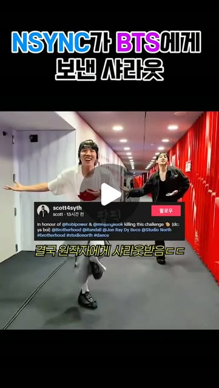</a> | [복부인만세 · 확산 스토리 정리 (NSYNC 반응까지)](https://www.instagram.com/p/DabiCMiTk0r/) | `bokbuinmanse` | 2026-07-05 | **12K** |
| <a href="https://www.instagram.com/p/DaujmAcmZAt/">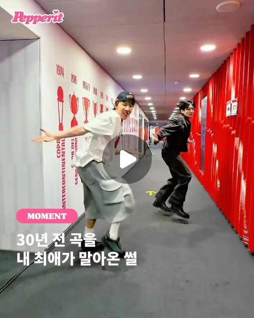</a> | [페퍼릿 · "30년 전 곡을 내 최애가 말아온 썰 👀"](https://www.instagram.com/p/DaujmAcmZAt/) | `pepperitmag` | 2026-07-13 | 314 |

## 3. K-pop 안무 챌린지

| 썸네일 | 챌린지 | 게시물 | 계정 | 날짜 | 좋아요 |
|---|---|---|---|---|---|
| <a href="https://www.instagram.com/p/DcsaQ1Nv1SU/">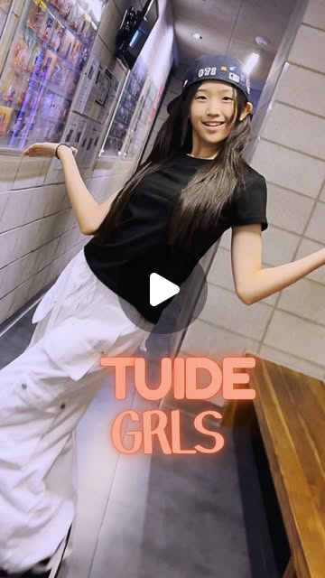</a> | **TUIDE 'GRLS'** 🆕 | [데프댄스 · "요즘 제대로 난리남 🔥"](https://www.instagram.com/p/DcsaQ1Nv1SU/) | `defdance_official` | 2026-08-30 | 260 |
| <a href="https://www.instagram.com/p/DbdMwGxPMSv/">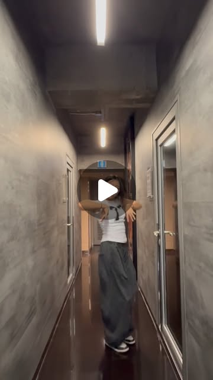</a> | 에스파 **Lemonade** | [데프댄스 수강생 버전 · "아직 끝나지 않았습니다"](https://www.instagram.com/p/DbdMwGxPMSv/) | `defdance_official` | 2026-07-31 | 221 |
| <a href="https://www.instagram.com/p/DZapKU3sQb-/">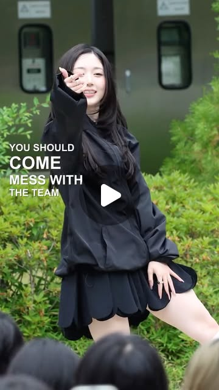</a> | CORTIS **〈REDRED〉** | [NMIXX 오해원 챌린지 (음악중심 팬미팅)](https://www.instagram.com/p/DZapKU3sQb-/) | `idolight.mag` | 2026-06-10 | **13K** |
| <a href="https://www.instagram.com/p/DZCkyQhTjlB/">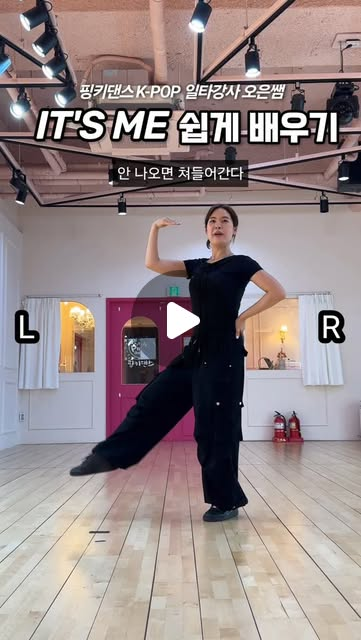</a> | 아일릿 **It's Me** | [안무 쉽게 배우기 튜토리얼](https://www.instagram.com/p/DZCkyQhTjlB/) | `pinkydance_dasan__` | 2026-06-01 | 3,046 |
| <a href="https://www.instagram.com/p/DbA-sNNOk98/">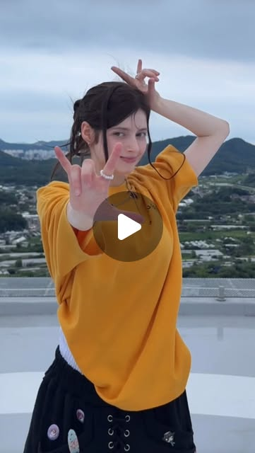</a> | 아일릿 **It's Me** | [외국인 모델 커버 버전](https://www.instagram.com/p/DbA-sNNOk98/) | `model__ella` | 2026-07-20 | 808 |

## 4. 기타 유행 안무

| 썸네일 | 챌린지 | 게시물 | 계정 | 날짜 | 좋아요 |
|---|---|---|---|---|---|
| <a href="https://www.instagram.com/p/Da5G4UOBK42/">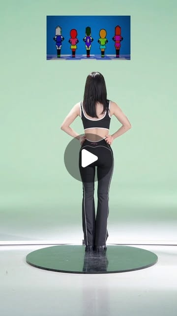</a> | **Aeropickles** (오이 댄스) | ["1234 ! 에어로빅 피클스 🥒"](https://www.instagram.com/p/Da5G4UOBK42/) | `imusmi_00` | 2026-07-17 | 7,305 |
| <a href="https://www.instagram.com/p/DaNOS69xhtH/">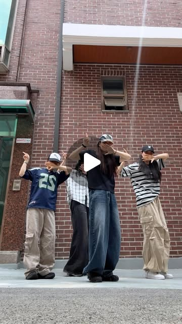</a> | **GG EZ** | [프론팅 · 4인 버전 "GG EZ👾"](https://www.instagram.com/p/DaNOS69xhtH/) | `fronting_official` | 2026-06-30 | 2,437 |
| <a href="https://www.instagram.com/p/DZtIiqoTxAi/">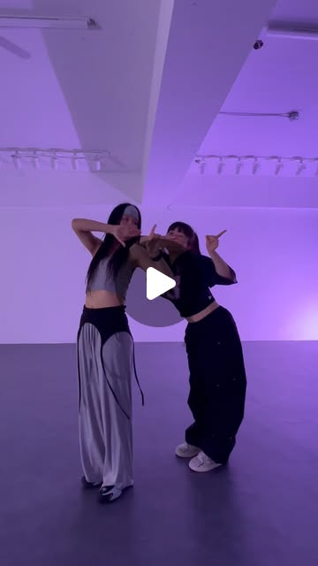</a> | **GG EZ** | [댄스 스튜디오 버전](https://www.instagram.com/p/DZtIiqoTxAi/) | `true_dancestudio` | 2026-06-17 | — |

## 5. 조회수가 터진 개별 릴스

특정 챌린지보다 **개인 화제성·반전 연출**로 확산된 사례. 챌린지 포맷을 빌려 쓰는 방식을 참고할 만합니다.

| 썸네일 | 게시물 | 계정 | 날짜 | 좋아요 |
|---|---|---|---|---|
| <a href="https://www.instagram.com/p/DasIZkpSn1c/">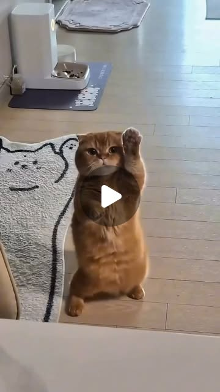</a> | ["처음에 낚이신 분들이 많은 영상 🤣 유행 탑승!"](https://www.instagram.com/p/DasIZkpSn1c/) | `big__bari` | 2026-07-12 | **197K** |
| <a href="https://www.instagram.com/p/DcfrIsAJPCv/">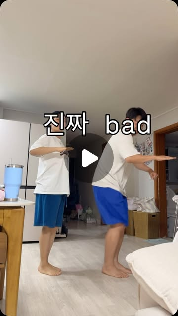</a> | ["결혼은 얼굴? 능력? 직업? 다 필요없다"](https://www.instagram.com/p/DcfrIsAJPCv/) | `adayday15` | 2026-08-26 | **59K** |
| <a href="https://www.instagram.com/p/DaDU13TRN9_/">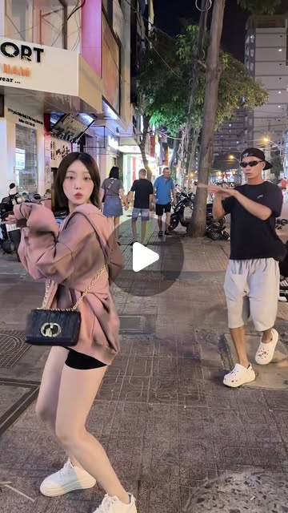</a> | [베트남 현지인이 챌린지에 난입 🇻🇳](https://www.instagram.com/p/DaDU13TRN9_/) | `dohee_e0` | 2026-06-26 | **16K** |

## 참고 · 검색 상위에 남아 있는 과거 트렌드

| 썸네일 | 게시물 | 계정 | 날짜 | 좋아요 |
|---|---|---|---|---|
| <a href="https://www.instagram.com/p/DF4lN-iv8ei/">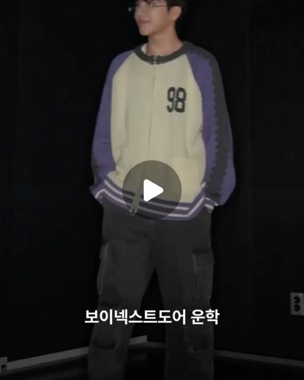</a> | [**랫 댄스(Rat Dance)** · 에스콰이어 정리글 — 틱톡커 'ratomilton'의 3D 쥐 캐릭터가 'Chess'에 맞춰 추는 춤](https://www.instagram.com/p/DF4lN-iv8ei/) | `esquire.korea` | 2025-02-09 | 5,592 |

> ⚠️ 랫 댄스는 **2025년 2월** 게시물로 "최근" 트렌드는 아니지만, 검색 상위에 계속 노출되고 있어 참고용으로 남깁니다.

---

## 정리

- **지금 잡아야 할 것**: `GUAP` — 8월 내내 검색 결과를 지배 중이며 아직 소진되지 않음
- **가장 안전한 것**: `I WANT YOU BACK` — 아이돌·일반인 양쪽에서 두 달 넘게 지속, 원곡 서사까지 있어 콘텐츠 확장성 좋음
- **선점 노릴 것**: `TUIDE 'GRLS'` — 8/30 등장한 신규 건, 아직 게시물 수가 적음
- **좋아요 기준 최고 성과**: `big__bari` 197K — 챌린지 자체보다 **"낚시 → 반전"** 구성이 주효

### 데이터 한계
- Instagram 검색 탭의 개인화된 추천 결과 기준이라 계정마다 다르게 보일 수 있습니다.
- 좋아요 수는 2026-09-05 수집 시점 값이며 `—` 는 게시자가 좋아요 수를 비공개한 경우입니다.
- 해시태그별 총 게시물 수는 Instagram이 비로그인/자동화 접근을 제한해 수집하지 않았습니다.
